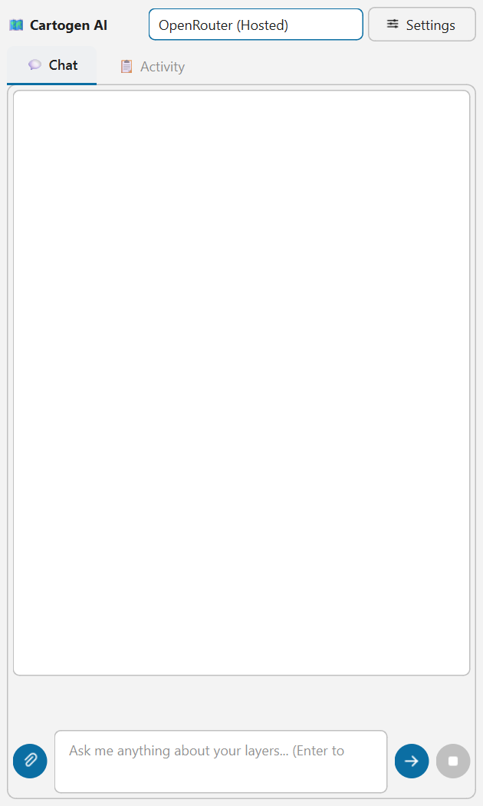
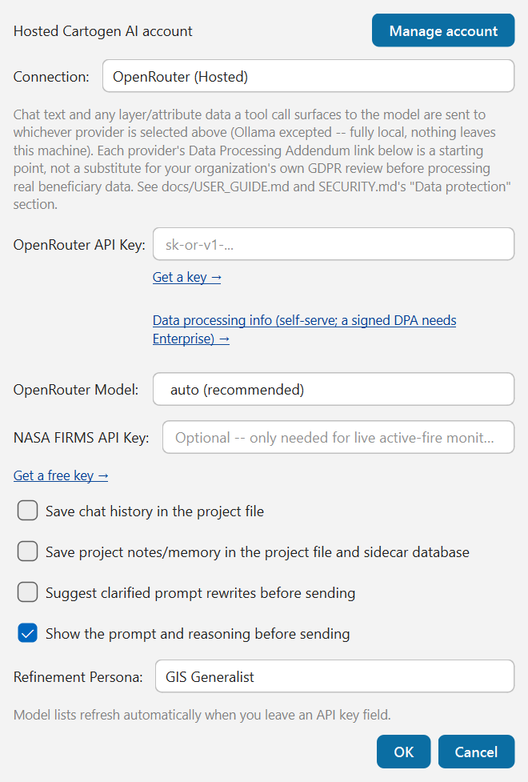
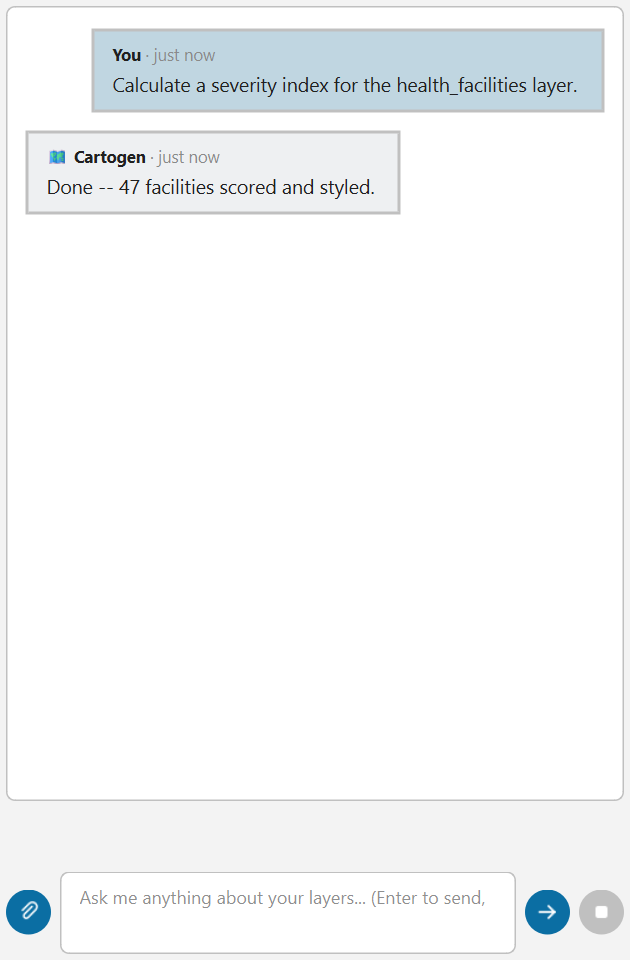

# User Guide

## The panel

Open **Cartogen AI** from the toolbar icon or the `Plugins` menu. It's a dock
panel (drag it to float, or dock it left/right) — one continuous scroll, not
separate tabs: a sticky **plan strip** for any active multi-step task sits above
the chat thread itself, so you never have to switch views mid-conversation to see
what the agent is doing.

The header has two buttons alongside the provider dropdown:
- **🗂 Memory** — opens the stored-memory dialog (project notes, learned
  preferences, export/clear controls — see "Project memory" below).
- **⚙ Settings** — provider, API keys, and safety toggles.

Help lives in `Plugins → Cartogen AI → Help` on the QGIS menu bar rather than in the dock
itself — it opens a standalone window with the provider list, quick tips, and example
prompts (built from the same data as this guide so it can't drift out of sync), and shows
the installed version number at the top of its own content.

### First launch

The very first time the plugin loads, a short **welcome dialog** appears asking your role/use
case, QGIS experience level, and preferred communication style — this takes a few seconds and
helps the agent tailor its tone and detail level (a beginner gets more explanation, an expert
gets less; a "concise" preference gets shorter answers). It's entirely optional — click **Skip
for now** and nothing changes. Answers are saved as a plain, human-readable `user_profile.md`
file in your QGIS profile folder, not a hidden settings blob — open and edit it directly anytime,
or revisit the same picker later from **Settings → Edit My Profile…**. The **Help** window (see
below) also opens automatically the first time, and again once after any future update, so
what's new/available stays easy to find without having to go looking for it.

## First-time setup

1. Click **Settings** in the dock header (top right, next to the provider dropdown).
2. Pick a provider from the dropdown: **OpenRouter**, **Gemini**, **Ollama**, **OpenAI**,
   or **Claude**.
3. Paste an API key (for Ollama, enter your local server's endpoint URL instead — no
   key needed). The key field auto-fetches that provider's live model list when you
   tab out of it. Get a key from the provider you picked:
   - OpenRouter (has a genuinely free tier covering many models — a good default if you
     don't already have a key with another provider): https://openrouter.ai/keys
   - Google Gemini: https://aistudio.google.com/apikey
   - OpenAI: https://platform.openai.com/api-keys
   - Anthropic Claude: https://console.anthropic.com/settings/keys
4. Pick a model, or leave it on **Auto** — the agent then routes simple requests to a
   cheaper/faster model and complex multi-step requests to a stronger one
   automatically, based on the request's wording and length. (Ollama always uses
   whatever model you pick; local models aren't a cost concern the auto-router needs
   to optimize for.)
5. Click OK. You can switch providers anytime from the small dropdown in the dock
   header without reopening Settings.

**NASA FIRMS API Key** (optional) — only needed for `fetch_nasa_active_fires` (live
satellite fire/thermal-anomaly monitoring, see "Live hazard monitoring" below). Every
other tool works without it. Get a free key at
[firms.modaps.eosdis.nasa.gov/api/area](https://firms.modaps.eosdis.nasa.gov/api/area/)
and paste it into this field — stored the same securely as any provider key.

If Settings needed to fall back to storing a key without encryption (rare — only
happens if QGIS's own encrypted credential store isn't available on your system),
you'll get a warning dialog saying so.

Settings also has a **"Save chat history in the project file"** checkbox, off by
default. Turning it on saves the conversation into the current project's `.qgz` file
so it's still there next time you open that project — but a project file is
something you might share, email, or commit elsewhere, and the conversation
travels with it if this is on. Leave it off unless you specifically want that.
Turning it back off later doesn't remove history a project already saved while it
was on.

### Hosted Cartogen AI account

If you want to use the hosted **Cartogen AI** API rather than bring your own
provider key:

1. Open Settings and click **Manage account**.
2. Enter the Cartogen account service URL supplied by your administrator.
3. Use **Create account** for a new account, or **Sign in** for an existing one.
4. If the service requires activation, follow its activation email before signing in.
5. Paste the separately assigned **Cartogen AI API key** from the account portal.
6. Select **Cartogen AI (Hosted)** as the Connection provider and click OK in Settings.

The account session and hosted API key are stored separately in QGIS's encrypted
credential store. The plugin never saves the password in QGIS settings, and the
hosted API key is never shown in plain text after the dialog closes. Local/BYOK
providers remain available and do not require a Cartogen account.

The account service URL must be an absolute `http://` or `https://` URL. Use HTTPS
for any non-local deployment. The current repository contains the client and UI
flow, but live account creation requires a deployed/configured Cartogen service.

## What happens to your message before it is sent

Cartogen AI carries the **Humanitarian Mapping Task Register** — 791 mapping
tasks grouped into 35 sections, each one describing what it needs, what tools
it should use, and what you should end up with. When you type a request, it is
matched against that register locally, on your machine. No API call is made to
do the matching, and the register itself is never sent to the model.

**Where it goes.** Once matched, the request text -- and any layer/attribute data a
tool call surfaces to the model -- is sent to whichever provider you selected in
Settings (OpenRouter, Gemini, OpenAI, or Claude), over that provider's own API, using
your own key. Ollama is the exception: it runs entirely on your machine, so nothing
leaves it. Settings shows each cloud provider's Data Processing Addendum link as a
starting point, but confirming a lawful basis and transfer mechanism for the data you
send is your organization's own responsibility, not something this plugin can
determine for you -- see [SECURITY.md](../SECURITY.md)'s "Data protection" section
before sending real beneficiary data.

**If your deployment has completed a DPIA sign-off** (see
[SECURITY.md](../SECURITY.md)'s "DPIA determination and deployment constraints"), that
determination may restrict which provider you're allowed to use for which kind of
data -- e.g. requiring Ollama for anything touching protection, incident, or
displacement attributes, and reserving cloud providers for anonymized or aggregated
data only. Check with your organization's DPO/GIS lead before assuming cloud is
approved for the specific data you're working with; the plugin itself does not enforce
this restriction today.

What the match is used for:

**Missing information.** If the task cannot proceed without something — which
hazard, which facility type, which sector — you are asked once, before
anything is sent. There is no default for these, because guessing a hazard
type produces a confidently wrong map. Things the plugin can work out for
itself (the area of interest, from the layers you have open) are not asked
about at all.

**The prompt preview.** Before the request goes anywhere, the assistant posts a
normal chat message showing the exact text that will be sent, and why:

- which task matched, and how confident the match was
- what you will get back — a styled layer, a PDF layout, an HTML dashboard, a
  CSV, a written report
- any value assumed on your behalf, stated in full
- what each attached file will be read as

Reply like you would to anything else. Confirming (e.g. "yes", "send", "go
ahead") sends what you saw in the preview. Typing anything else sends your
own wording instead, with no enrichment at all — for when the matched task is
simply wrong. Replying "cancel" (or "no", "stop") abandons it. You can turn
the preview off in Settings; it is on by default, because it exists so that
nothing is added to your message without you seeing it.

**Attachments.** A file you attach is classified and routed to the tool that
can read it:

| You attach | It becomes |
|---|---|
| a PDF situation report | its tables, extracted (text as fallback) |
| a Word document | its tables, extracted |
| a plain text file | text read straight into the request |
| a photo or scanned map | segmented for features, or georeferenced |
| a CSV/Excel 3W file | organisational presence per admin unit |
| a CSV/Excel dataset | a layer, or a table to aggregate |
| a shapefile, GeoJSON, GeoPackage, GeoTIFF | a layer in your project |

The file is analysed when you attach it, and is also carried into your next
message so it becomes part of the task rather than a separate question.

**The output you were promised.** After the answer comes back, the tools that
actually ran are compared against what the task said you would get. If you
were told you would get an HTML dashboard and the step that writes it never
ran, the plugin says so and asks for it once — never in a loop. If it still
does not appear, you are told that plainly rather than being handed a
description of a file that was never written.

## Chatting

Type a request and press **Enter** (Shift+Enter for a new line) or click the **send
button** (the arrow, right of the input box). For example prompts, see
`Plugins → Cartogen AI → Help`.

The reply itself is real Markdown — tables, bold text, lists, and code blocks all render
formatted, not as raw text.

While a request is running:
- The status line shows what the agent is doing right now (e.g. "Thinking...", a specific
  tool name) — this updates in place rather than adding a new line each time, so a
  multi-step request doesn't fill the chat log with live progress chatter.
- Click the **stop button** (next to Send) to cancel it. This is cooperative, not instant — it stops the
  agent before its *next* step (another model call or tool call), not mid-flight, so
  there can be a short delay after clicking before it actually stops.

Once a turn that called any tools finishes, one compact line summarizes what ran (e.g. "🔧
3 tool calls · Calculate severity index, Apply graduated style, Export dashboard") —
click **Details ▾** to expand it into a per-step list, or leave it collapsed. If any step
failed, its full error text always shows directly underneath regardless of whether the
summary is expanded or collapsed — failures are never hidden behind a click.

### Attaching files

Click the **attach button** (paperclip, left of the input box) to attach a PDF, Word
document, image, CSV, or Excel file.

- PDF/Word: full text is extracted and given to the agent. If the data you actually
  need is in a table (a sitrep's "IDPs by district" table, a needs-assessment
  matrix), ask explicitly, e.g. *"extract the tables from this PDF"* -- the plain-text
  extraction flattens tables into hard-to-use text, but the agent can pull real
  structured rows/columns instead when asked.
- Images: sent directly to the model for visual analysis — this only works if your
  current provider/model supports vision (Claude and GPT-4o/GPT-5-class models do;
  many smaller/free models don't).
- **CSV/Excel**: the agent gets a short preview (column names, row count, a few
  sample rows) *plus* the real file path. If you want the full dataset actually
  loaded into the project rather than just described, ask for that explicitly, e.g.
  *"load this as a layer"* — the agent will use the full file, not the preview.

Optional file-parsing packages (PDF/Word/Excel support, plus PDF table extraction and
chart generation) need to be installed via the qpip plugin dependency prompt, or
manually — see the main [README](../README.md). If
they're missing, attaching that file type gives a clear error telling you what to
install rather than failing silently.

## Multi-step requests and the plan strip

For anything involving several distinct steps, the agent creates a visible **plan** in
the sticky strip above the chat thread: a progress bar (e.g. *"3/4 steps complete"*, or
*"3/4 steps complete — 1 needs you"* when a step is waiting on your decision) and a list
of tasks, each showing TODO → IN PROGRESS → DONE (or FAILED). Click a task row to open
its inspector — result, rationale, any code it ran, and action buttons for that task's
current state:
- **✔ Confirm and Apply Edit** — appears for a task in `PREVIEW_READY` state (see
  "Destructive actions" below); approves and executes it.
- **✕ Cancel** — cancels a `PREVIEW_READY` task instead of confirming it.
- **🔁 Retry** — re-runs a `FAILED` task.
- **✏️ Edit and Resend** — pre-fills the input box with an editable prompt for that
  task's description so you can adjust it before resending (doesn't auto-send).
- **📋 Copy Snippet** — copies the task's PyQGIS code (if any) to the clipboard.

The strip's own **✕** button clears the currently visible plan. The dropdown next to
the plan title lets you browse **plan history** (the last 5 plans this session) without
losing the live one — selecting an older plan is read-only browsing; sending a new
message automatically snaps back to the live plan.

## Project memory

The agent can remember facts across the conversation (and across QGIS sessions, tied
to the current project file) via `store_project_memory`/`store_global_memory`. Click
**🗂 Memory** in the dock header to see what's stored, with a search box to filter it,
an **Export My Data** button, and **🗑 Clear Project Memory**/**🗑 Clear Global Memory**
buttons.

## Layer context

By default, every loaded layer's schema (field names, geometry type, feature count) is
visible to the model so it can answer questions about your project without you having
to spell out every layer by name. Click the **layers icon** next to the input box to
choose which layers' schema Cartogen can actually see for a given question — each layer
defaults checked, except one you've already tagged `RESTRICTED`/`SENSITIVE` via
`set_layer_sensitivity`, which defaults unchecked. Cartogen sends only a schema and a
sample of rows for whatever's checked, never a whole table. This is opt-out, not
opt-in — if you never open it, nothing changes from today's behavior.

## Destructive actions

Removing a layer or running a field calculator mutation always goes through a
preview-then-confirm gate: the agent shows what it's about to do as a card right in the
chat (layer, field, the code that will run) with **Apply edit**/**Cancel** links, and
also waits for an explicit confirmation — clicking those links, replying "Confirm"/
"cancel" in chat, or using the task inspector's buttons all resolve the exact same way.
It cannot skip this by itself, even if prompted to (the confirmation flag isn't
something a tool call can set; only you approving it can).

## Sensitive point data

Before mapping, exporting, or reporting on individually-identified sensitive locations
(GBV survivors, individual IDP households, named protection cases), use
`obfuscate_sensitive_points` first — a Do No Harm safeguard, and increasingly an explicit
donor/ECHO compliance requirement. Three methods, in your layer's own CRS units (not
meters — reproject first if a specific real-world distance matters, since a geographic
CRS would otherwise scatter points by hundreds of kilometers):

- **`grid_snap`** — every point sharing a grid cell moves to that cell's center. The
  strongest protection: multiple true locations become genuinely indistinguishable, not
  just displaced.
- **`jitter`** — random displacement within a radius. Still a 1:1 point per input point.
- **`admin_unit_snap`** — moves each point to the centroid of the admin-boundary polygon
  it falls within (needs a separate polygon layer of those boundaries).

The agent won't apply this automatically — it's a judgment call about the data, and it'll
ask which method you want when it looks relevant. Not every point layer needs it (facility
locations, aggregate counts, and non-identifying incident logs don't).

## Interactive HTML dashboards

`generate_html_dashboard` exports one or more layers as a single interactive Leaflet map
(pan/zoom, layer toggles, click-a-feature popups) — the deliverable to send a fund-allocation
committee or donor who won't open QGIS themselves. **It needs internet access to view, not
just to generate.** The file itself is created offline, but opening it in a browser loads the
map library and basemap tiles from public CDNs each time — it is not a fully offline package,
despite being a single file with no server to run. If the actual audience has no reliable
connectivity, use a static export instead (`print_map`, `create_print_layout`,
`generate_report`) rather than this.

Popups show whatever field names the layer actually has, which are often technical
(`food_insec_pct`, `wash_depriv_pct`). If you want real language instead — e.g. "Food Insecurity
(IPC 3+) %" — ask for it explicitly (or the agent should offer it unprompted once it knows what
the fields mean): a field with no requested label falls back to a mechanical Title Case of its raw
name (`food_insec_pct` → `Food Insec Pct`), which is readable but not real language.

## Building footprint data

`fetch_building_footprints` pulls from Microsoft's Global ML Building Footprints dataset —
pre-computed polygons covering 225 countries/regions, good for baseline digitization where no
local footprint data exists (in-limit boundary work, population/exposure estimates). **This is
not live extraction from a specific image, and it is not damage assessment.** It's Microsoft's
own periodic dataset refresh, so it can lag the very latest imagery by months — a destroyed or
newly-built structure may not be reflected yet. For damage assessment against a specific
before/after image pair, use `calculate_raster_change_detection` instead; for road networks,
`fetch_osm_features` already covers that (`key='highway'`) and isn't affected by this caveat.

## Local base data (download once instead of fetching live)

When a request needs a **road network** — travel time, service areas, routing — and the project
doesn't have a line layer that looks like roads, Cartogen asks once before sending anything to the
model:

- **download**: Cartogen finds the OpenStreetMap extract for the area your map is showing
  (Geofabrik; Jordan is about 60 MB), downloads it in the background, and adds **OSM Roads
  (<region>)** and, for health requests, **Health Facilities (OSM, <region>)**. Health facilities
  are hospitals, clinics, doctors and dentists, including hospitals mapped as building outlines
  (about half of Jordan's), stored as points in a GeoPackage. Pharmacies are left out. Files are
  saved in the project's `data/00_raw/osm/` folder (or a folder in your QGIS profile if the
  project isn't saved yet), and a copy less than a week old is reused. If the extract is larger
  than 150 MB, Cartogen tells you the size and asks again. **Stop** cancels the download and ends
  the request.
- **online**: the request goes ahead as before, fetching data live from OpenStreetMap's Overpass
  server. Cartogen won't ask again for the rest of the session. Saying "online" in the request
  itself also skips the question.

Why: live Overpass requests fail often when the server is busy, each failure costs one of the
agent's tool calls, and a live query only covers a small area. A country extract covers the whole
area and includes road type, speed limit and one-way data.

The question also lists other sources that offer downloadable versions of the data, if you'd
rather load your own:

| Data | Sources |
|---|---|
| Roads | Geofabrik (used for download), HOT OSM exports on HDX, HOT Export Tool, BBBike extracts, Overture Maps |
| Health facilities | Geofabrik (used for download), HOT OSM exports on HDX, healthsites.io |
| Population | WorldPop, GHSL (EU JRC) |
| Admin boundaries | geoBoundaries, HDX (OCHA COD-AB where available), GADM (non-commercial only) |
| Buildings | Microsoft Global ML Building Footprints, Google Open Buildings |
| Elevation | Copernicus DEM GLO-30 |

The map's location is used only on your machine, to choose which extract to download. It is not
sent to the AI model. OpenStreetMap data is © OpenStreetMap contributors, ODbL.

## Live hazard monitoring

Three tools pull live hazard data for a bounding box and load it straight into the
project as a real layer:

| Tool | Source | Needs a key? |
|---|---|---|
| `fetch_nasa_active_fires` | NASA FIRMS (VIIRS satellite active-fire/thermal-anomaly detections) | Yes — free, see "First-time setup" above |
| `fetch_nasa_eonet_events` | NASA EONET (wildfires, storms, volcanoes, floods, and more) | No |
| `fetch_gdacs_disaster_alerts` | GDACS (UN-coordinated disaster alerts, Green/Orange/Red severity) | No |

Ask for one directly (*"fetch active fires over this area"*), or get all three at once
in a ready-to-view dashboard: *"give me a hazard situation dashboard for this area"*
calls `generate_situation_dashboard`, which fetches all three sources and exports them
as one interactive HTML map in a single step.

**Re-running one of these on the same area replaces that layer's data with the latest
fetch** — it doesn't pile up duplicate layers — so re-fetching by hand (or asking the
agent to re-run one) at any point is always safe.

**Scheduling a recurring check.** `save_workflow_preset` + `schedule_recurring_workflow`
exist for *read-only analysis tools* (e.g. `calculate_severity_index`, `forecast_trend`)
— save one as a named preset and schedule it (e.g. every 30 minutes), and each run is
automatically diffed against the previous one for a plain-language change summary. **The
3 hazard-fetch tools above are not usable as a scheduled workflow step** (a known
GUI-freeze risk under audit, 2026-09-13 — they do network I/O, and a scheduled run
executes synchronously on the QGIS main thread) — for an ongoing hazard watch, re-run one
manually or ask the agent to check again periodically, rather than scheduling it. This is
session-scoped either way: it only runs while QGIS stays open with the plugin loaded, not
a background service that keeps working after you close QGIS.
`list_scheduled_workflows`/`stop_recurring_workflow` show and cancel active schedules.

**Freshness badges.** Any layer fetched by these tools carries a stamped fetch time.
`generate_html_dashboard`/`generate_temporal_dashboard` show it as a small colored pill
next to that layer — green ("Fresh, 2m ago"), amber ("Stale, 3h ago"), or red ("Very
stale, 2d ago") — so you can tell at a glance whether the data on screen is current
without checking anywhere else. A layer that was never fetched from a live source
(most layers) shows no badge, which is correct, not a gap.

## Troubleshooting

- **"No API key configured"** — open Settings and add a key for the active provider.
- **A provider request fails** — cloud providers automatically retry transient
  errors and fall back to an alternate model if the configured one is retired; if you
  still see an error, check the message text (invalid key, quota exceeded, and
  genuinely-down services all report distinctly).
- **A request stops with "Reached the tool-call limit"** — this usually means the
  request needed many individual actions (e.g. one call per item in a long list) —
  try rephrasing so it can be done in bulk (*"create one layer with all of them"*), or
  split it into smaller requests.
- **Something claims success but doesn't look right** — the agent cross-checks its
  own final answer against every tool call it actually made that turn (not just the
  last one) and appends a correction if any failure goes unacknowledged, but this only
  catches an *unacknowledged* mismatch, not every possible error — treat map/data
  outputs the way you would any automated tool, and verify anything consequential.
- **A CSV/Excel file loaded but has no location data, or points landed in the wrong
  place** — `load_tabular_data_as_layer` auto-detects coordinate columns by name
  (`latitude`/`lat`/`y`, `longitude`/`long`/`lon`/`lng`/`x`, or `wkt`/`geom`/`geometry`).
  If your columns are named something else (e.g. `Coord_N`, `POINT_X`), it can't guess
  confidently and returns `FIELD_SUGGESTION` with the real column names instead of
  guessing wrong — ask again naming the correct columns and it'll build the layer from
  those. If it does build a layer but every point is in the wrong place (or it refuses
  with a coordinate-range error), the most common cause is `x_field`/`y_field` pointing
  at the wrong columns, or data that isn't actually in WGS84 degrees (e.g. UTM meters) —
  pass the correct `crs` if so.

See [SECURITY.md](../SECURITY.md) for what's protected against and what's explicitly
out of scope, and [docs/TOOLS_REFERENCE.md](TOOLS_REFERENCE.md) for the full tool list.
